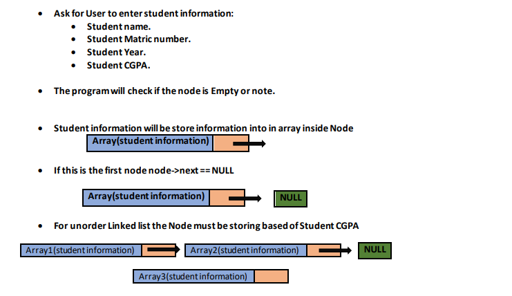
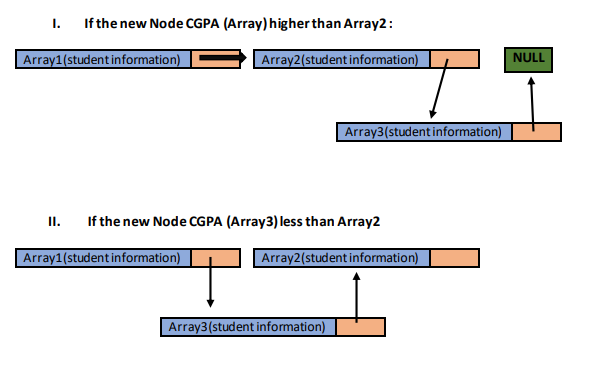
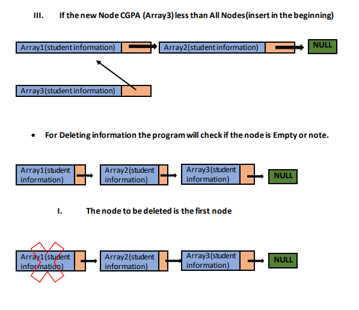
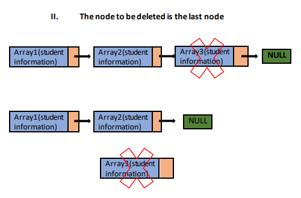
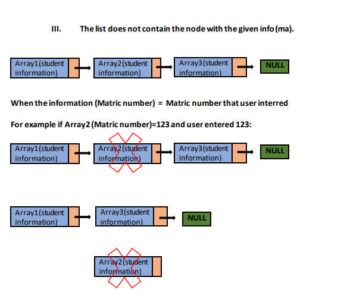

****Linked_List_Program****

This program creates a linked list that will store the information which are Student Name, Matric Number, Year, and CGPA. 
and Delete the information, Search for student Data, and Display student data. 
The program will ask the user to enter the student data and store it into the linked list in two ways (Ordered and Unordered).

**• INPUT:**
 There are many options that users can choose:
 The input that the user will enter is student information:
  1. Student Name.
  2. Matric Number.
  3. Year.
  4. CGPA.
  
 • Then will be many options that users can choose:
 • User can add new student information.
 • User can delete any student information.
 • User can display all students' information.
 • User can search for specific student information.
 • User can list all students in a specific Year.
 • User can list all students with specific CGPA.

**• OUTPUT:**
The program will give users many options to choose:
• [1]ADD new student data.
• [2]Delete student data.
• [3]DISPLAY all information data.
• [4]Search for the student by Matric Number.
• [0] Exit
If the user choose [1] program will ask the user to enter student information.
If the user chooses [2] program will ask the user to enter which Node that he/she wants to delete.
If the user chooses [3] the information that is already stored in the Node will be displayed.
If the user chooses [4] user will enter the matric number of the student to see his/her information, or enter
the year or enter the CGPA, then the program will search for those students and print the information.

**• PROCESS AND FORMULA:**

